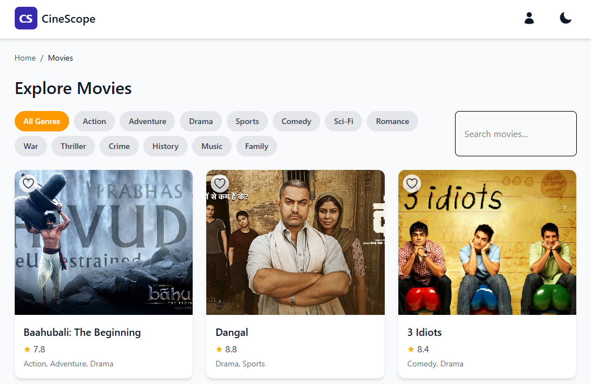

<div align="center">
  <br />
  
  <br />

  <div>
    
    
    
    
    
    
    
  </div>

  <h3 align="center">CineScope - Modern Movie Website</h3>

  <div align="center">
    A sleek and responsive movie website built using React.js, Tailwind CSS, TypeScript, Framer Motion, GSAP, and React Bits, showcasing advanced design principles and animations.
  </div>

  <div align="center">
    🌐 <strong>Live Demo</strong>: <a href="https://your-live-demo-link.com">CineScope</a>
  </div>
</div>

---

## 📋 Table of Contents

1. [Introduction](#introduction)  
2. [Tech Stack](#tech-stack)  
3. [Features](#features)  
4. [Quick Start](#quick-start)  
5. [Installation](#installation)  
6. [License](#license)  
7. [Acknowledgements](#acknowledgements)  

---

## Introduction

CineScope is a modern movie website developed using React.js, Tailwind CSS, TypeScript, Framer Motion, GSAP, and React Bits. It features a clean design, smooth animations, and responsive layouts, making it a perfect reference for modern web development projects.

---

## Tech Stack

- **Vite**: Lightning-fast build tool for modern web projects.  
- **React.js**: Component-based library for building user interfaces.  
- **Tailwind CSS**: Utility-first CSS framework for rapid UI development.  
- **TypeScript**: Strongly typed programming language for scalable and maintainable code.  
- **Framer Motion**: Animation library for React to create smooth and interactive animations.  
- **GSAP (GreenSock Animation Platform)**: Powerful JavaScript library for creating high-performance animations.  
- **React Bits**: Collection of reusable React components and utilities.  

---

## Features

👉 **Movie List and Details**: Browse movies, view detailed information, and explore related movies.  
👉 **Favorites Management**: Add movies to favorites and manage your favorite list.  
👉 **Responsive Design**: Ensures seamless functionality and aesthetics across all devices.  
👉 **Dynamic Filtering**: Filter movies by genre, search term, and pagination.  
👉 **Image Carousel**: Interactive carousel for movie images.  
👉 **Dark Mode Support**: Toggle between light and dark themes.  
👉 **Advanced Animations**: Smooth transitions and effects powered by Framer Motion and GSAP.  

---

## Quick Start

Follow these steps to set up the project locally on your machine.

### Prerequisites

Make sure you have the following installed:

- [Git](https://git-scm.com/)
- [Node.js](https://nodejs.org/en)
- [npm](https://www.npmjs.com/)

## Cloning the Repository

```bash
git clone https://github.com/your-username/cine-scope.git
cd cine-scope
```
##  Installation
Step 1: Install the Project Dependencies
Run the following command to install the project dependencies:
```bash
npm install
```
Step 2: Running the Project
Run the development server with the following command:
```bash
npm run dev
```
##  License
This project is licensed under the MIT License. See the LICENSE file for details.

##  Acknowledgements
React.js
Tailwind CSS
Vite
TypeScript
Framer Motion
GSAP
React Bits
